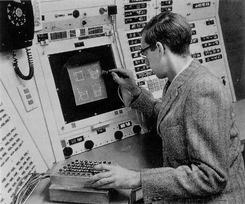
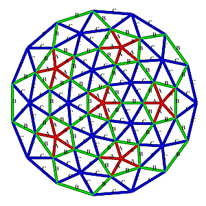
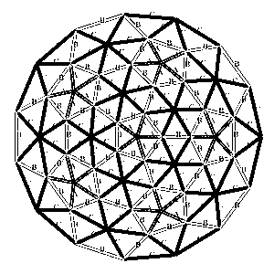
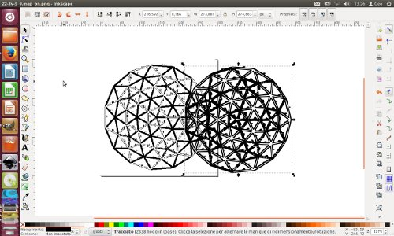
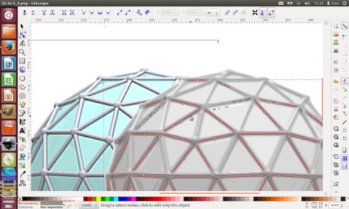

## Summary

- [Introduction](#introduction)
- [Learning path](#learningpath)
- [Conclusions](#conclusion)

## Introduction
The goal of this class is to **explore software** usefull to realize *2D sketches* and *3D model* or *4D presentation* of our final project. 

Neil focused his speach on a panoramic view over various softwares that can build the job described above and how well they can do this. The principal suggestion that i took from the speech is that there isn't an "absolute software" that can resolve all the problems that you can encounter in sketching your project but **each project has specific needs** and **consequently you have to use the right software for realize it**.

So it is for me in this assignement explore as much software as i can and determine my feeling with it.

## Learning path
I approach this week assignement with this goal in mind:
- Use Gimp to work with the images that are in my site and fix some graphical problem that i noticed.
- Explore the functionality of Inkscape (and the vectorial graphics) to realize a "cianography style" 2D sketch of my final project.
- General approach with 3D modeling software like: SketchUp, Openscad, Blender and Antimony. The goal of this software panoramic is to determine which is the best tool to model the geodesic dome of my project.

#### Gimp and the image
I tried Gimp to fix dimension and graphycal aspects of some jpg images in my personal website. The program is preinstalled in my version 12.04 of Ubuntu and there are no particular problem in the use of it.
I am familiar with Adobe Photoshop and i think that Gimp is a perfect opensource substitute.
I also used this program to trasform a color image in a 8 bit image of a geodesic dome plant design. I thought that this trasformation could help me in the process of vectorialize it with the use of Inkscape.

|  |  |

#### Vectorialize an image with Inkscape
I was not familiar with Inkscape and vectorial graphics and so after an initial approach familiarizing the interface of the program and basic commands i thought to do do a full immersion in some tutorials. I found some tutorial short and well done that explored separetly the basical functions of Inkscape. Unfourtunatly they are in Italian but i am sure that it is possible to find something similar on the web. This is the tutorials's list:

- [Inkscape Tutorial - Part 0](https://www.youtube.com/watch?v=Mcxkx02FikI)
- [Inkscape Tutorial - Part 1](https://www.youtube.com/watch?v=1HRQgKF2RIM)
- ...
- [Inkscape Tutorial - Part 13](https://www.youtube.com/watch?v=_hUfV_-2TNM)

After this finally i approach my problem: create a realistic "cianography style" version of my final project. I noted immediatly that design a geodesic dome is not a trivial task.
Principally i had to define which kind of geodesic dome i want to build and this task take me a lot of time: first of all to understand which differences are the most important in this kind of structure (mathematics, nomenclature and so on) and secondary which geodesic dome structure is the best for my needs.
I found a tons of informations in these two websites: [Simply Differently](https://simplydifferently.org/Geodesic_Dome_Notes?page=3#3V%204/9%20Icosahedron%20Dome) and [Desert dome](http://www.desertdomes.com/).
After clearing my toughts on the dome style i choose to model a: **3V 5/9 Icosahedron dome**.
The first approach to design the model was to start from a bitmap image and vectorialize it. These are some images of the process:

I discovered that this isn't a correct way to complete the task. And so i decided to proceed to redesign all the trace by hand, scan it and then vectorialize the path. This is the result of the process:

#### Software for 3D modeling
The exploration of 3D softwares was a parallel activity with the exploration of 2D software but because i am not familiar with this kind of software my learning curve was very steep. 
The approach in this case is to jump directly on my specific problem and learn how to model a geodesic dome (that i think it will be the most difficult part to model) using various software.

Below the trying done:

**SketchUp**
Using this [tutorial](http://www.instructables.com/id/Construct-Geodesic-Spheres-on-Google-SketchUp/) i produced this partial part of the dome.

**Openscad**

**Blender**

**Antimony**

The installation of Antimony was not a simple task. In fact in my Ubuntu 12.04 LTS the process fail because of lacking of some python library: libboost...

Manca immagine

I tried in many ways to resolve this problem and this process i found a usefull tool named [pyenv](). It is a version manager of python install that could bypass your standard installation of python and fix the version of the program that you could use to compile and install.
Unfourtunately this was not usefull. 
To resolve the issue a tried an update of my os and also if i wasn't sure that it was the right option for my old laptop. Fourtunatly all went well and with Ubuntu 14.04 LTS installed and python updated the installation of antimony was easy. 

## Conclusions

The exploration of 3D softwares was very quick because of the problems encountered in 2D modelling took me a lot of time and i am not satisfied of the result.

