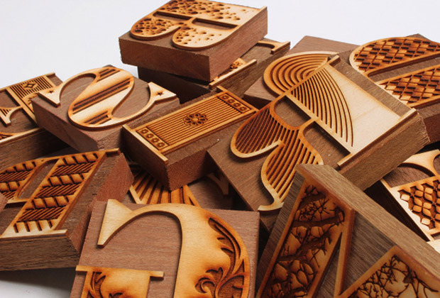
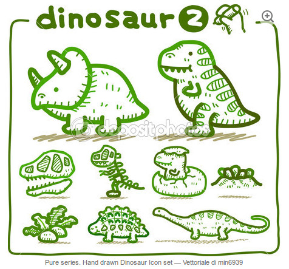
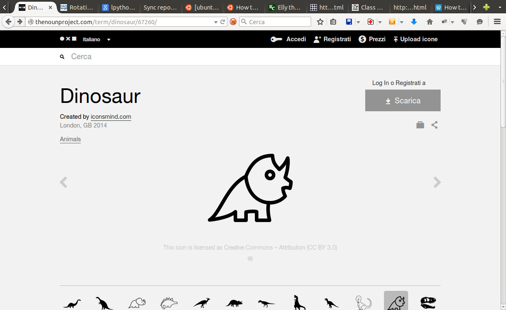
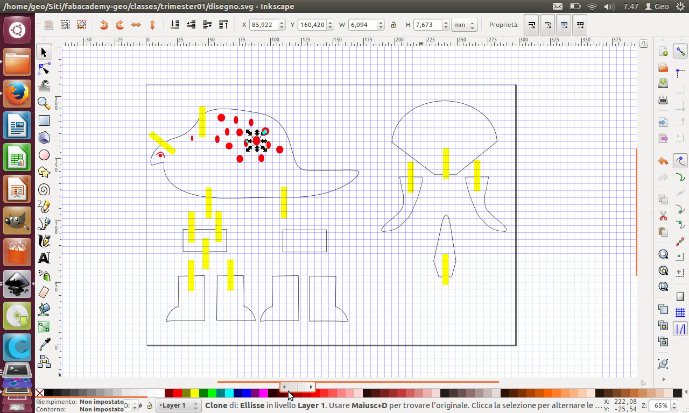

## Summary

- [Introduction](#introduction)
- [Learning path](#learningpath)
- [Conclusion](#conclusion)

## Introduction

The assignements of this week is to realize a press fit kit using a lasercutter and a cardboard.

## Learning path

The idea to accomplish this assignement is to realize a toy with the technique of press fit. In particular i want to realize a 3d puzzle dinosaur for my children. 

I am not familiar with laser cutting and press fit kit so my approach is to realize something simple in the first time that could help me to explore this technique. In a second time i want to use this technique to realize something a little bit trickie and the box that could contain electronics stuff for my final project. 

First of all i search some sketches of a simple dinousaur around the net. I would have something that could be trasformed in a 3d press fit kit and i though that a tricerops could be the right dinosaur because of his spikes, horns and typical head. In fact all these elements could be easly designed to be assembled to the body of the dinousaur with simple joint, giving to it a tridimensional shape. 
I found something interesting in a free search on internet (colored image):

Thanks to a tip of a friend (Angela) i explored also an interest site where you can search vectorial image by theme: [The noun project](http://thenounproject.com). This is another triceropsimage that i found on it:

In the second step i draw by hand a tricerops starting from the inspirational image above, keeping in mind the idea of trasform this 2d design (plain design) in a 3d design. In particular i scomposed the elements that could be attached with joints to the principal body of the dinosaur. 
The initial sketch is described in the picture below:

Defined the final shape of my kit, i opened Inkscape and designed a vectorial image of each components of my kit. I designed piecies: the principal body with the head, four legs, two support for the legs, three horns and the cresta ossea. This is the results that i obtained:

In this first approximation of final design i draw only a rough sketch of the joints because i did't know the meausure of the thickness of the cardboard that i would used.

- Cardboard measure (table)
- Design of the joints
- Refine the final design (clean the path of the design, reduce thickness 0,01 mm, define colour of the line to instruct the laser cutter with the order of cutting: red --> first cut inside, black --> last cut contorni)
- Testing the joints
- Cutting the board
- Assemble the kit

  

## Conclusion
Great potential of the technique due to his precision, speed pf work and versatility.
Inspiration from project of other students creating modular and complex objects.
My new steps is to realize cinematism using cardbard and laser cutting modifying my initial design.