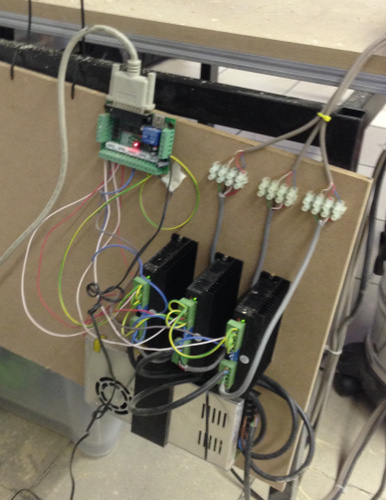
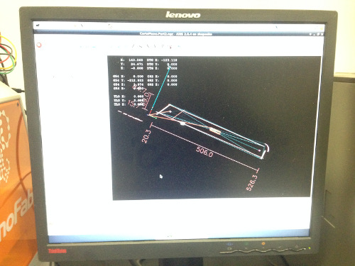
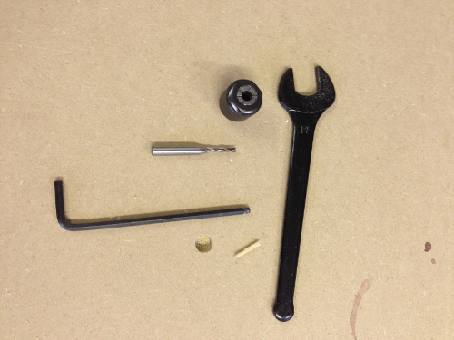
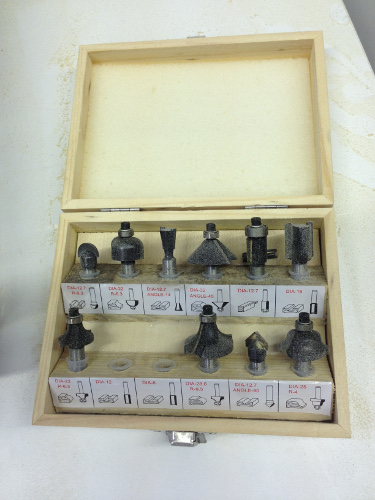
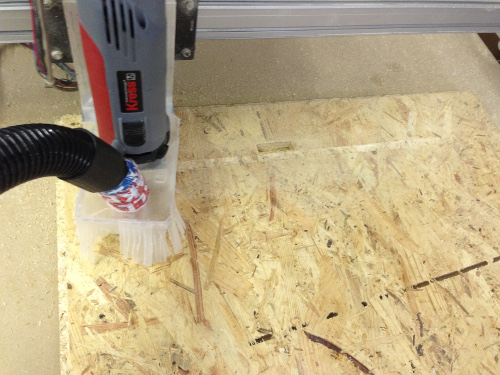
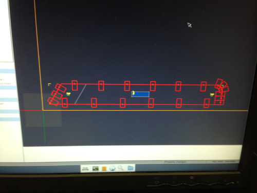
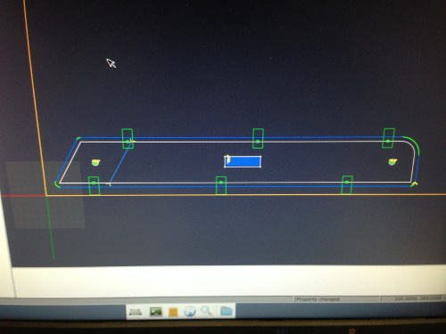

## Summary

- [Introduction](#introduction)
- [Learning path](#learningpath)
- [Conclusion](#conclusion)

## Introduction

I am triyng to build a baby chair (Fabbolone) starting from an existent design (Tripp Trapp from Stokke) adding to it a plane where you can put baby's toys and/or food.

## Learning path

- Design the fabbolone with Solid Works
	- first problem: i used a lot of constructionn line: the file seem a mess.
	- second problem: it was difficult to extrude the parts in one process. I think that it is not the correct way to proceed
	- solution to problems above: cleaning the design (erase construction line) and then extruded single surfaces of each pieces. Good extrusion, good results. This process is not necessary for the process of milling but it was a good exercise to learn Solidworks
	- Another big problem was to generate simmetrical pieces of the project: i tried to use the specular function in various way: on the 3d part and on the sketch but it was nota simple task and the result is not good.
	- Solution that i found to generate the specular pieces of my project was to extrude the sketch one time up to the plane and the other time down the plane. This easy trick was my salvation.

|  |  |

- Export the single pieces in dxf (needed photo of the process)
- Milling machine: shapeoko modified with a powerfull spindle and a nema motor 22 on z axis. All the motors are powered with 36 v and professional driver. The machine is connected via serial cable to a pc with LinuxCNC installed

|| |

- The CAM we used is Cambam. Importing in it the dxf i prepare the cam version of single pieces of fabbolone.
- The cam files are saved in .ngc format (gcode) and sended via Linux CNC to the milling machine
- It is important to set the machine, choose the right milling tip for the work, then testing the milling machine with the z axis up (flying test). 

|| |

- If all the steps above are ok it is possible to proceed. 

- Problem: the first piece milled is not what i want. Analyzing the file in cambam we saw that something was wrong.

- The next step is to correct cambam files and proceed to mill it again.

|||

## Conclusion
