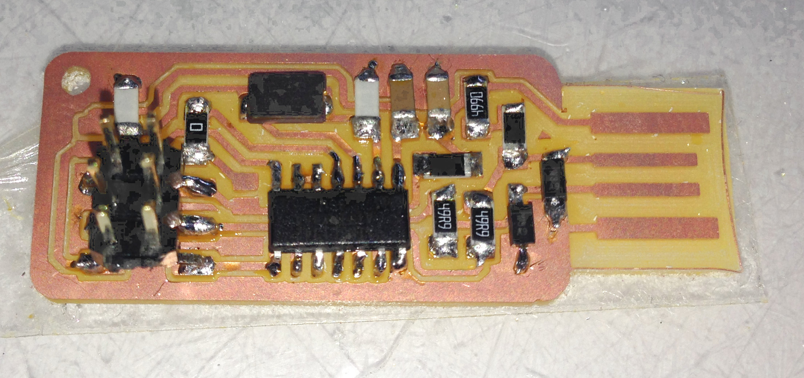
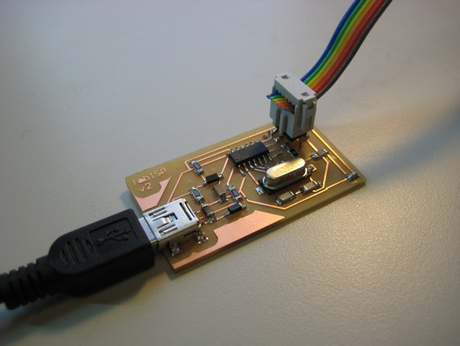

## Summary

- [Introduction](#introduction)
- [Learning path](#learningpath)
- [Conclusion](#conclusion)

## Introduction
Not use etching but milling: great for prototipe but bad for production.
The assignement of this week is to build a FabISP using a machining tools.
a milling machine, a copper sheet supported on phenolic paper (FR1) a vectorialize image of the circuit path, a schematic 

## Learning path

### What is FabISP
A FabISP is a piece of electronics usefull to program AVR microcontroller. It is designed for electronic production in the fablab and it allow you to program the microcontrollers on other boards. This particular version of FabISB is based on [Andy's design](http://fab.cba.mit.edu/content/projects/fabispkey/index.html):

This model of FabISP can be powered putting it directly on a USB port and you can use the same method (a 6-pin IDC to 6-pin IDC cable) to connect it to another microcontroller that you want to program.

### Schematics
Here the image of that represent schematics of the circuit, assembly drawing and building drawing:

|||||

Finally this is the BOM neede to ralize the fabisp:

### Fabrication

- setting the milling machine
- kind of punte used
- soldering
- testing (tester and smoke test)
- programming process (no on ubuntu, yes on mac)
- testing again: (yes on ubuntu, no on mac)
- rework of the soldering the solders: they had to become shiny and brite
- test single components with tester
- after rework: ok on ubuntu and mac

How i realized it:

- pick up a pdf file with schematics, 
- past to the milling machine (instruction and video), 
- define the bom utilized to realized the circuit, 
- sold the components (hit parade of my good and bad solder), 
- test the board and final step program the board (using arduino).
 

## Conclusion
Without any knowledge in electronics i build my first electronic board. I think this is the amazing think that i learned from this class, in other words it is possible to build simple circuit with good schems, minimal skills to sold components (improuving working on it) a little money.