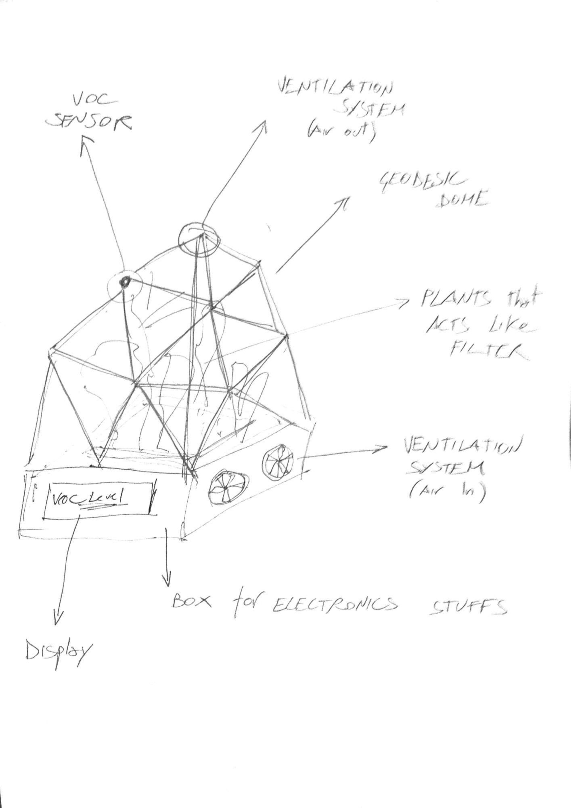
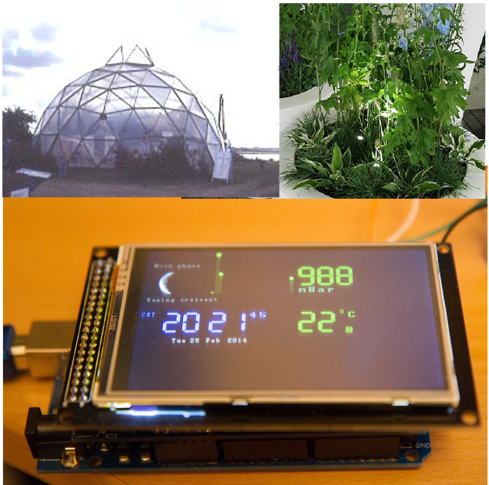

## Summary

- [The concept](#the-concept)
- [Milestones to achieve](#milestones)
- [Extra features](#extrafeature)
- [Organization of the work](#organizationwork)
- [Interesting reads](#reads)

## The concept

The idea of the my final project is to realize an air filter that could improve the quality of the polluted air that can be found inside a room of an house.
The problem of the pollution inside buildings is well known and usually is tackled in a "mechanical ways": utilising air ventilation systems and mechanical filters. But this approach is not the most efficiente in term of treating the most common compounds that are responsible of the indoor pollution: the volatile organic compound (VOC). 
I would like to approach the problem using the best filter known in the world that can destroy easily this kind of compounds: plants. 
Also this technique to tackle the problem is well known but i think that also plants need an improvement.
In particular to use plant in an efficient way i think that is necessary to augment their capacity to intercept polluted air.

This is why i though to merge the mechanical approach and the plant approach in my final project.

So the idea is to build an air filter utilizing plants stored in a transparent geodesic dome where can be pumped polluted air with a ventilation system air. This polluted air will be purified from plants and then pumped out in the ambient.

These are preliminary sketchs usefull to imagine the final idea:

	

		 
	

	

		
	

## Milestones to achieve

## Extra fetures

## Organization of the work

## Interesting Reads

